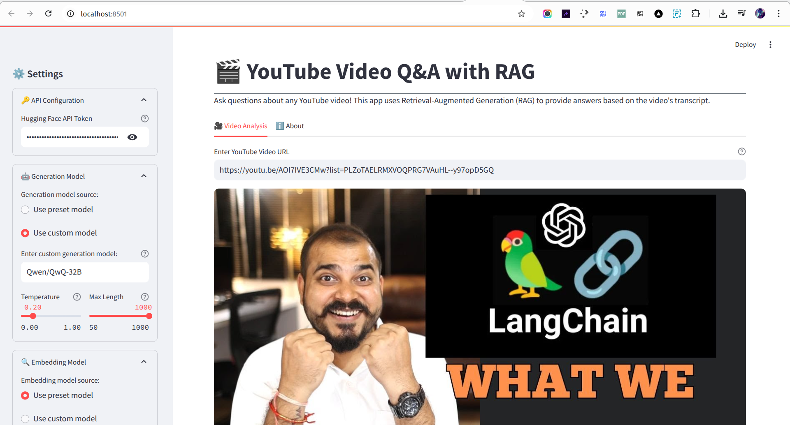
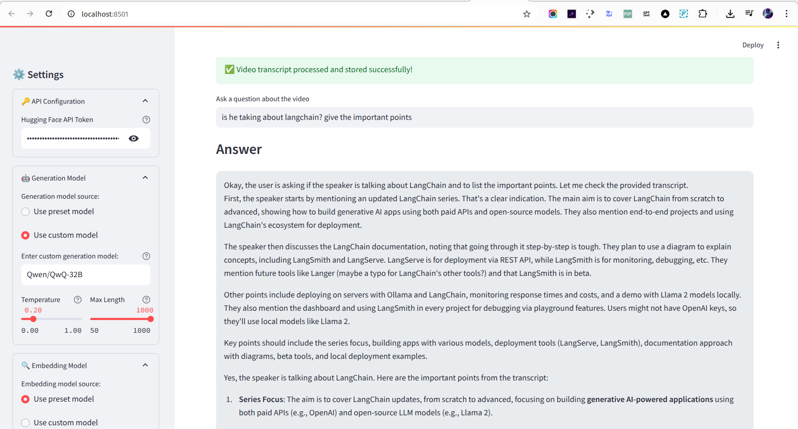
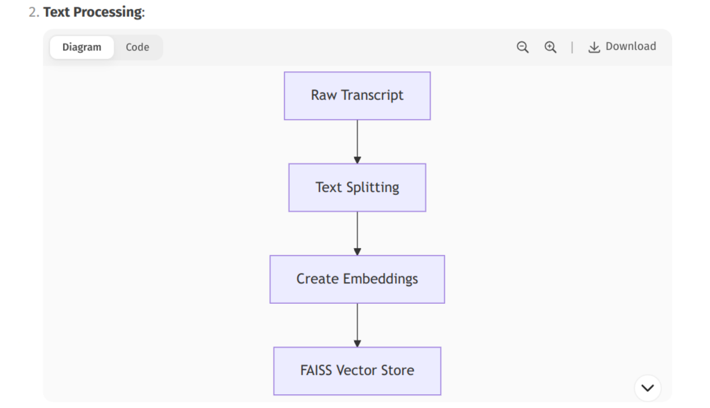
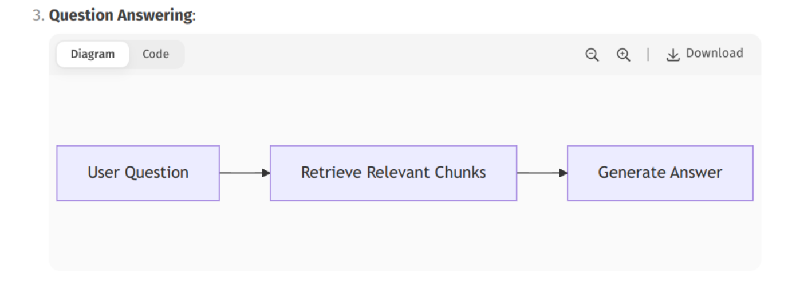
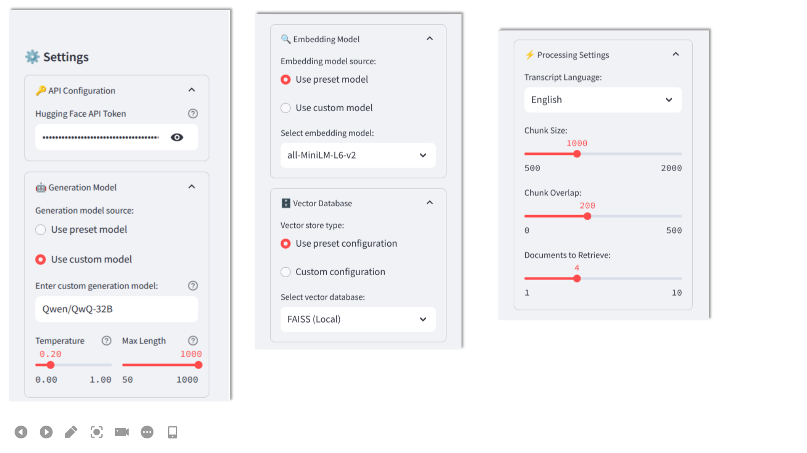
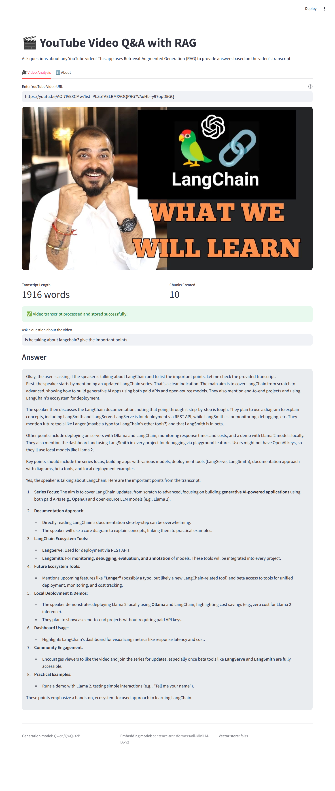

# 🎮 YouTube Video Q&A with RAG

<div align="center">
  


</div>

---

## 📌 Table of Contents

- [🌟 Features](#-features)
- [🎥 Demo](#-demo)
- [🚀 Installation](#-installation)
- [⚙️ Usage](#%ef%b8%8f-usage)
- [🪠 Configuration](#-configuration)
- [🧐 How It Works](#-how-it-works)
- [💻 Tech Stack](#-tech-stack)
- [🦘 Support](#-support)
- [📜 License](#-license)

---

## 🌟 Features

- ✔️ Automatic YouTube transcript extraction
- ✔️ Customizable Hugging Face models (both generation and embeddings)
- ✔️ Adjustable text chunking parameters
- ✔️ FAISS vector store for efficient similarity search
- ✔️ Beautiful Streamlit UI with dark/light mode
- ✔️ Multi-language support
- ✔️ Context-aware question answering

---

## 🎥 Demo
*Main UI*
 
*Result*



---

## 🚀 Installation

### 📋 Prerequisites

- Python 3.8+
- [Hugging Face Account](https://huggingface.co)
- [FFmpeg](https://ffmpeg.org/) (for audio processing if needed)

### 🛆 Steps

```bash
# Clone repository
https://github.com/pande17827/YouTube-Video-Q-A-with-RAG.git
cd YouTube-Video-Q-A-with-RAG

# Create virtual environment
python -m venv venv

# Activate environment
# On Windows:
venv\Scripts\activate
# On macOS/Linux:
source venv/bin/activate

# Install dependencies
pip install -r requirements.txt
```

### 🚀 Running the App

```bash
streamlit run app.py
```

---

## 🪠 Configuration

### 🔧 Model Options

| 🧙️‍♂️ Component  | ⚙️ Options                                                                 |
|--------------|------------------------------------------------------------------------------|
| 🤖 **LLM**        | Qwen, Mistral, FLAN-T5, BART, GPT-2, or custom                                |
| 🧠 **Embeddings** | all-MiniLM-L6-v2, bge-small-en, e5-small-v2, or custom                      |
| 💃✨ **Vector DB**   | FAISS, Chroma, Weaviate, Pinecone, Qdrant                                   |

### 🌐 Environment Variables

Create a `.env` file in the root directory with the following content:

```ini
HUGGINGFACEHUB_API_TOKEN=your_hf_token_here

# Optional depending on vector DB choice:
PINECONE_API_KEY=your_pinecone_key
PINECONE_ENV=your_environment
QDRANT_API_KEY=your_qdrant_key
```

---

## 📊 Project Structure

```
youtube-qa-rag/
├── app.py                # Main application code
├── requirements.txt      # Python dependencies
├── README.md             # This documentation
├── .env.example          # Environment variables template
├── docs/                 # Documentation assets
|   └── final_result.png
|   └── Question_Answering.png
│   ├── result.png
│   └── setiing.png
|   └── Text_preprocessing.png
|   └── transcript Extraction.png
|   └── ui.png
└── .gitignore            # Git ignore rules
```

---

## 🌟 Features in Detail

### 1. Video Processing Pipeline
🎥 **Pipeline**  
The project includes a robust video processing pipeline designed to handle everything from ingestion to analysis.





### 2. 🛠️ Customizable Components

```python
# Example of switching vector stores
vector_store = create_vector_store(
    chunks,
    embeddings,
    "pinecone",  # or "faiss", "chroma", etc.
    pinecone_api_key=os.getenv("PINECONE_API_KEY"),
    pinecone_env="us-west1-gcp",
    pinecone_index="youtube-videos"
)
```

### 3. Beautiful UI Components

🖼️ **UI Highlights**  
- **Video thumbnail preview**: Quickly view video snapshots.  
- **Interactive settings panel**: Customize processing parameters on the fly.  
- **Real-time processing indicators**: Monitor progress as tasks are completed.  
- **Responsive answer display**: Get results in a clean and readable format.

---

## 🤖 Supported Models

### Generation Models

| **Model**           | **Size** | **Best For**             |
|---------------------|----------|--------------------------|
| Qwen/Qwen1.5-32B    | 32B      | General purpose          |
| Mistral-7B          | 7B       | High-quality responses   |
| FLAN-T5 Large       | 3B       | Summarization tasks      |

### Embedding Models

| **Model**           | **Dimensions** | **Speed**   |
|---------------------|----------------|-------------|
| all-MiniLM-L6-v2    | 384            | Fast        |
| bge-small-en        | 384            | Balanced    |
| e5-small-v2         | 384            | Efficient   |

---

## 🗓️ Vector Database Options

| **Database** | **Type**  | **Persistence** | **Best For**            |
|--------------|-----------|-----------------|-------------------------|
| FAISS        | Local     | No              | Quick experiments       |
| Chroma       | Local     | Optional        | Development             |
| Pinecone     | Cloud     | Yes             | Production              |
| Qdrant       | Both      | Yes             | Scalable solutions      |

---

## 📚 How It Works

1. **Transcript Extraction**  
   Gets video captions using the YouTube API.  

2. **Text Processing**  
   Splits the transcript into chunks with configurable sizes.  

3. **Embedding Generation**  
   Creates vector representations of the processed text.  

4. **Vector Storage**  
   Stores the generated vectors in the selected database.  

5. **Question Answering**  
   Retrieves relevant context from the stored data and generates accurate answers.

---

## 🛠️ Customization

### Adding New Models

You can easily add new models by updating the predefined models dictionary:

```python
llm_options["New Model"] = "username/model-name"
```

### Using Different Databases

Implement new database connectors in the `create_vector_store()` function to integrate additional vector databases seamlessly.

---

## 📸 Screenshots

| **Settings Panel**       | **Answer Display**         |
|--------------------------|----------------------------|
|  |  |
|

---

## 🤝 Contributing

Contributions are what make the open-source community an amazing place to learn and grow. Here's how you can contribute:

1. Fork the project.  
2. Create your feature branch:  
   ```bash
   git checkout -b feature/AmazingFeature
   ```
3. Commit your changes:  
   ```bash
   git commit -m 'Add some AmazingFeature'
   ```
4. Push to the branch:  
   ```bash
   git push origin feature/AmazingFeature
   ```
5. Open a Pull Request.

---

## 📜 License

This project is distributed under the **MIT License**. See the [LICENSE](LICENSE) file for more information.

---

## ✉️ Contact

Feel free to reach out with any questions or suggestions:

- **Your Name**: [Vikas Kumar](https://twitter.com/yourtwitter)  
- **Email**: [pande.17827@gmail.com](mailto:your.email@example.com)  
- **Project Link**: https://github.com/pande17827/YouTube-Video-Q-A-with-RAG.git

---

**Note:** To use this README:
1. Replace placeholder URLs with your actual project links
2. Add real screenshots
3. Update contact information
4. Customize any sections to better match your project

